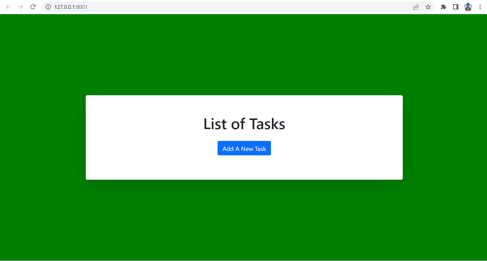
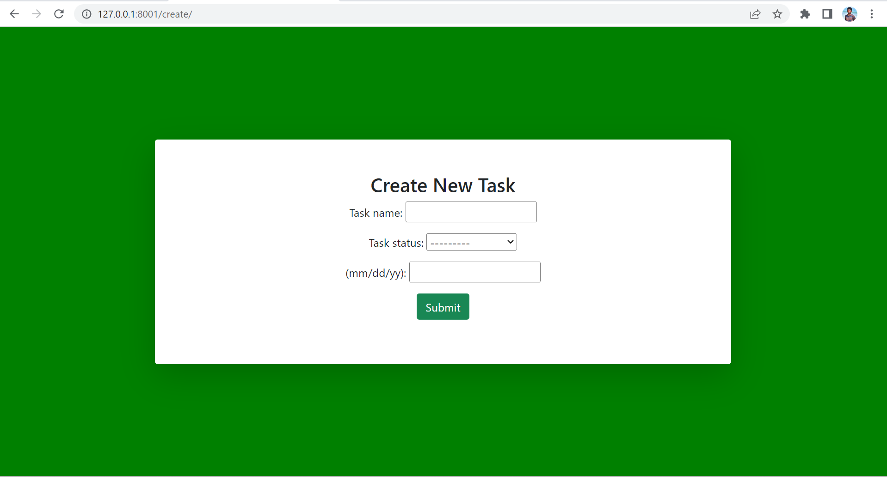
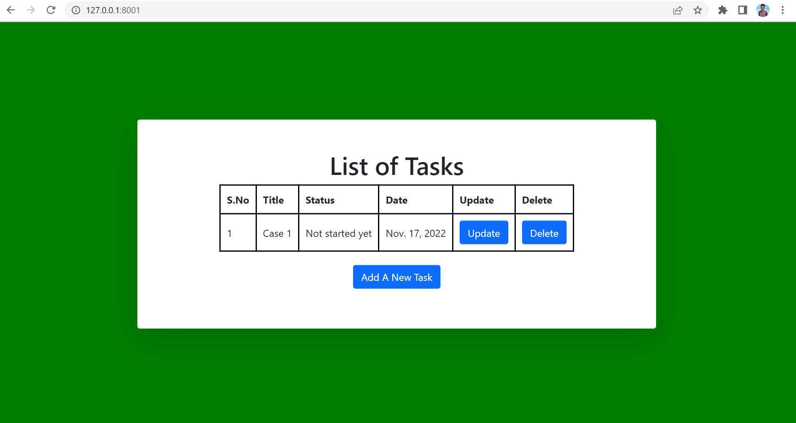
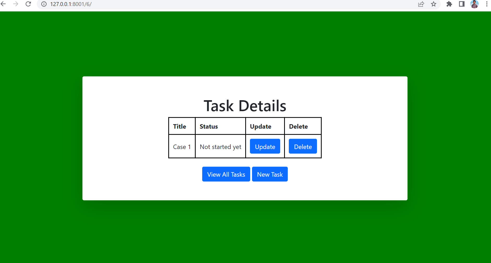

# django-crud.github.io
This is a basic Crud application, in which we can add various tasks and we can perform several operations like updation and deletion.

Steps to run: 
1.Open Folder in Vscode Editor 
2.Open New Terminal 
3.Type command "python manage.py makemigrations" 
4.Then Type "python manage.py migrate" 
5.Then Type "python manage.py runserver" 
6.We will get a server (Starting development server at http://127.0.0.1:8001/) open that. 

After opening:

If we want to add Tasks, Click on Add Task

after adding new task:

If we want to update the Task, Click on "Update". If we want to delete the Task, Click on "Delete".

After Updating, It will show the details again.

        © 2022 Copyright: <a class="text-gray-800 fn1" href="#">Vamsi</a>
    

